# Quick Tutorial

# Getting Started with MQTT

We will now start showing simple demos on how to use MQTT. But before we begin, you need to prepare an MQTT Broker and an MQTT Client.

# Prepare an MQTT Broker

For the purpose of this training exercise, you can choose to create an MQTT Broker via private deployment or a free public broker for testing.

- ## Private deployment

  In this demo, I will be using [EMQX](https://www.emqx.io/), an open-source MQTT broker for IOT, IIOT, and connected vehicles for deploying in local machine.

  If you have docker installed, you can run the following command to install EMQX:

  `docker run -d --name emqx -p 1883:1883 -p 8083:8083 -p 8084:8084 -p 8883:8883 -p 18083:18083 emqx/emqx`

- ## Free Public Broker

  You can set the below server information if you opt to use a free public broker.

  | **Name**      | **Broker Address**        | **TCP Port** | **TLS Port** | **WebSocket Port(s)** |
  | ------------- | ------------------------- | ------------ | ------------ | --------------------- |
  | EMQX (Global) | `broker.emqx.io`          | 1883         | 8883         | 8083, 8084            |
  | EMQX (CN)     | `broker-cn.emqx.io`       | 1883         | 8883         | 8083, 8084            |
  | Eclipse       | `mqtt.eclipseprojects.io` | 1883         | 8883         | 80, 443               |
  | Mosquitto     | `test.mosquitto.org`      | 1883         | 8883, 8884   | 80, 443               |
  | HiveMQ        | `broker.hivemq.com`       | 1883         | N/A          | 8000                  |

# Prepare an MQTT Client

We will use the MQTT client tool provided by MQTTX that has support for:

- browser access - [http://www.emqx.io/online-mqtt-client](http://www.emqx.io/online-mqtt-client)
- desktop client - [https://mqttx.app](https://mqttx.app)
- command line tool - [https://mqttx.app/cli](https://mqttx.app/cli)

In the demos, I wil be using the desktop client but using the browser or CLI works fine as well.

[MQTTX](https://mqttx.app/) is an elegant cross-platform MQTT 5.0 desktop client that runs on macOS, Linux, and Windows. The user-friendly chat-style interface enables users to easily create multiple MQTT/MQTTS connections and publish/subscribe MQTT messages.

There are also [open-source MQTT client libraries for different programming languages](https://www.emqx.com/en/mqtt-client-sdk). We will use two of those as we create a mobile application in flutter to communicate with our ESP8266 NodeMCU later.

# Create an MQTT Connection

To use MQTT for communication, the client must establish an MQTT connection with the broker.

1. Check if your broker is working properly. Open the dashboard at [http://localhost:18083](http://localhost:18083) and login with the default credentials `admin:public`. Make sure you can access your cluster and it's alive and healthy.

   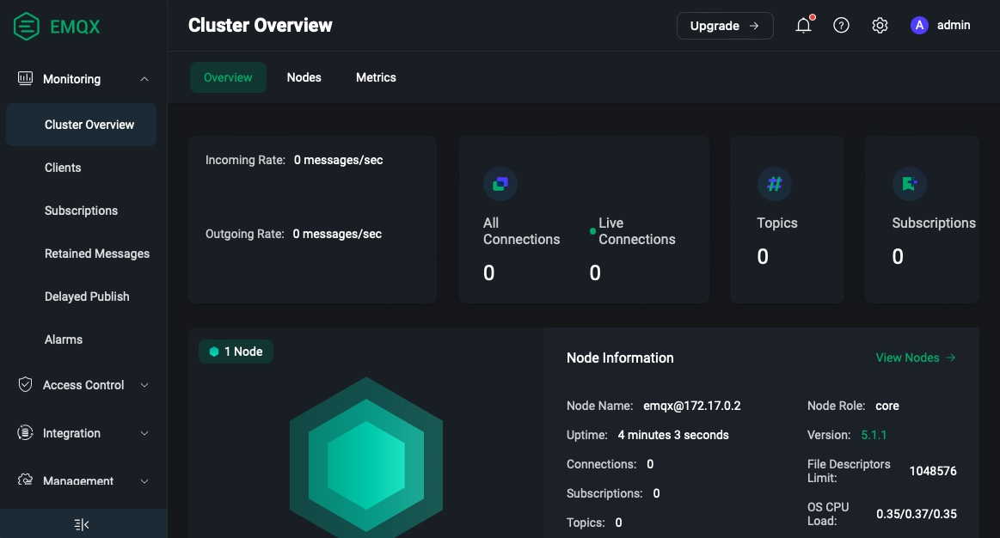

1. Next, open your MQTT client and click on the `New Connection` button.
1. Fill in `iPBL-Demo` in the `Name` field and your IP Address (or the public broker address) in the `Host` field.
1. Click the `Connect` button in the upper right corner and confirm that a `Connected` popup is shown indicating the connection is established successfully.

   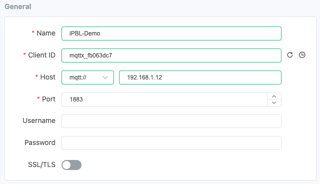

   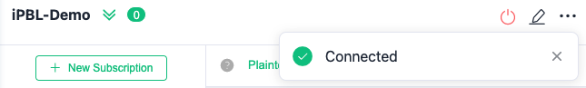

# Subscribe to a Topic

In this demo, we are going to subscribe to a wildcard topic `sensor/+/temperature` in the `iPBL-Demo` connection created earlier. This listens for temperature data reported by all other sensor clients.

1. Click on the `New Subscription` button and enter the topic `sensor/+/temperature` in the `Topic` field of the pop-up box.
2. Keep the default QoS at 0 and click `Confirm`.

   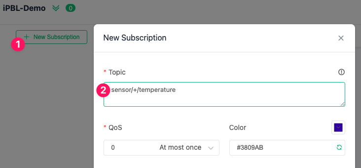

3. When the subscription is successful, an additional record in the the subscription list is shown.

   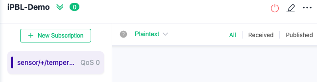

# Publish MQTT Messages

1. Create two more connections and name them `sensor-01` and `sensor-02` respectively to simulate two temperature sensors.

   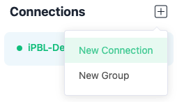

1. Once the connections are created, you will see three connections and the online status dots to the left of the connection names are shown green.

   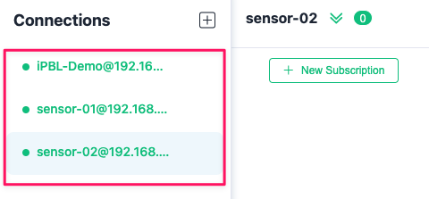

1. You can also group together related connections by creating a `New Group`, select the connections you want to group and drag them to the new group created.

   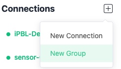

   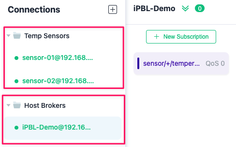

1. To send a message, select `sensor-01` connection and enter the topic as `sensor/01/temperature` in the bottom left part of the page. Choose the payload type, fill in the message box, and click the publish button at the bottom right.

   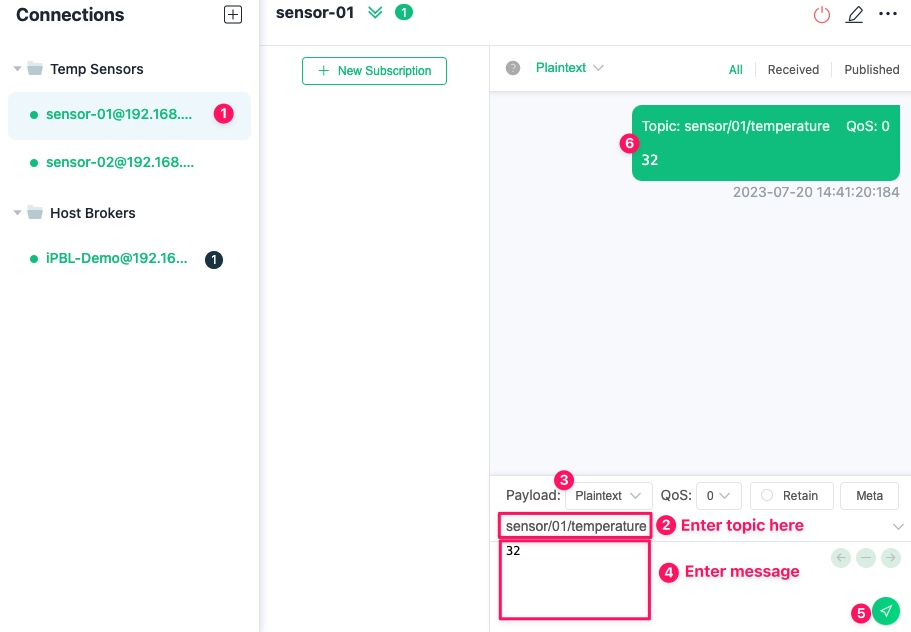

1. Using the same steps, publish new payload message to the `sensor/02/temperature` topic in the `sensor-02` connection.
1. You will see two new messages under `iPBL-Demo` connection as they are being sent by the two sensors.

   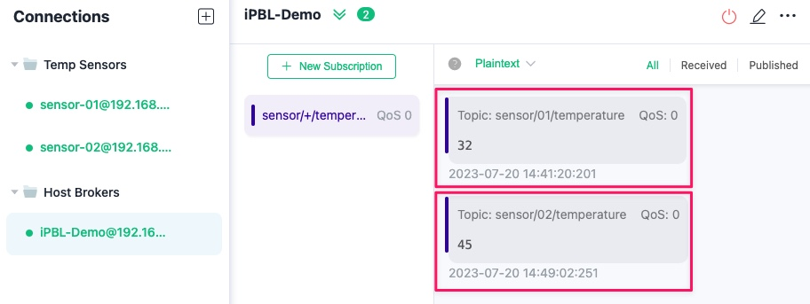

This concludes our brief demonstration of the Publish-Subscribe pattern in MQTT. The MQTTX client tool supports additional features, allowing you to explore beyond the pub-sub pattern.

In the next section, we will expand on these ideas and develop a mobile app to control the built-in LED light of an ESP8266 NodeMCU.
