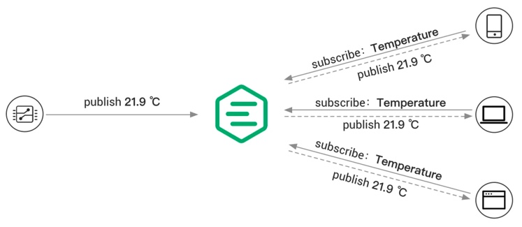

# MQTT 協議的解釋

# MQTT 係咩嚟㗎？

MQTT 的意思是訊息佇列遙測傳輸（Message Queuing Telemetry Transport）。這是一種為物聯網（Internet of Things）環境中的設備之間進行簡單且高效通訊而創建的通訊協議。

MQTT 協議使用發布-訂閱模式進行有效的數據傳輸，允許設備將消息發布到特定主題，其他設備訂閱這些主題以接收消息。這樣可以減少網絡帶寬的使用。

MQTT 的一些重要特點包括：

1. 輕量級：MQTT 被設計為一個輕量級協議，適用於具有有限處理能力和帶寬的受限裝置。
2. 非同步通訊：MQTT 允許設備以非同步方式發送和接收訊息，即使在不可靠的網路環境下也能實現高效的通訊。
3. MQTT 有三个质量服务等级（QoS），用于确定消息传递的可靠性。这些等级包括 QoS 0、QoS 1 和 QoS 2。
   - QoS 0 (最多一次)
   - QoS 1（至少一次）
   - QoS 2（確保一次）
4. 可扩展性：MQTT 非常可扩展，可以支持大量设备和订阅者，使其成为物联网部署的理想选择。
5. 高效的网络使用：MQTT 使用紧凑的二进制消息格式，有助于最小化网络带宽使用。

MQTT 在物聯網行業中因其簡潔、高效和能夠與各種設備和平台配合工作的能力而受到歡迎。它廣泛應用於家庭自動化、工業監控和遠程通訊等應用中，這些應用中高效可靠的通訊至關重要。

# MQTT 如何運作

為了了解 MQTT 的工作原理，你需要掌握以下基本概念：

## MQTT 客戶端

- 任何運行 MQTT 客戶端庫的應用程序或設備都是 MQTT 客戶端。例如，使用 MQTT 的聊天消息應用程序是一個客戶端，使用 MQTT 上報數據的傳感器也是一個客戶端，MQTT 測試工具也是一個客戶端。

## MQTT 代理

- 該經紀人處理連接、斷開連接、訂閱和取消訂閱的請求以及訊息的路由。

## 發佈-訂閱模式

- 正如其名所示，這是一種用於發送和接收 MQTT 消息的模式。發布者和訂閱者無需建立直接連接，因為 MQTT Broker 負責路由和分發所有消息。
- 下面的圖表顯示了 MQTT 的發布/訂閱過程。溫度感應器作為客戶端連接到 MQTT 服務器並將溫度數據發布到一個主題（例如，`temp`），服務器接收到消息並將其轉發給所有訂閱了`temp`主題的客戶端。

## 話題

MQTT 協議使用主題來路由消息，這些主題使用斜線（`/`）組織成層次結構，類似於 URL 路徑。例如，

- `chat/room/1`
- `sensor/10/temperature`
- `sensor/+/temperature`

MQTT 題目支援以下萬用符號：`+` 和 `#`

- `+` 表示一個單層的通配符，例如 `a/+` 可以匹配到 `a/x` 或 `a/y`。
- `#` 表示多级通配符，例如 `a/#` 匹配 `a/x`，`a/b/c/d` 等。

更多關於 MQTT 主題的詳細資訊，請參閱 Case 的博客《[理解 MQTT 主題和通配符](https://www.emqx.com/en/blog/advanced-features-of-mqtt-topics)》。

## 服務品質（QoS）

MQTT 提供三種不同的服務品質，並且在不同的網路環境中保證訊息的可靠性。

- QoS 0: 訊息最多會傳送一次。如果用戶端目前無法使用，則會遺失該訊息。
- QoS 1: 訊息至少傳遞一次。訊息重複的機會很高。
- QoS 2：訊息只有送達一次。

更多關於 MQTT QoS 的詳細資訊，請查看《[介紹 MQTT QoS（服務質量）的部落格](https://www.emqx.com/en/blog/introduction-to-mqtt-qos)》。

# MQTT 工作流程

現在我們了解了 MQTT 的基本組件，讓我們看看一般工作流程如何運作：

1. 客戶使用 TCP/IP 連接到代理者，可以選擇使用 TLS/SSL 加密進行安全通信。客戶提供身份驗證憑據並指定乾淨或持久的會話。
2. 客戶可以將訊息發佈到特定的主題，或者訂閱主題來接收訊息。發布的客戶將訊息發送到代理人，而訂閱的客戶則表達對於接收特定主題訊息的興趣。
3. 經紀人接收已發布的訊息並將其轉發給訂閱相關主題的所有客戶端。它根據指定的服務品質（QoS）水平確保可靠的訊息傳遞，並根據會話類型為斷開連接的客戶端管理訊息存儲。
